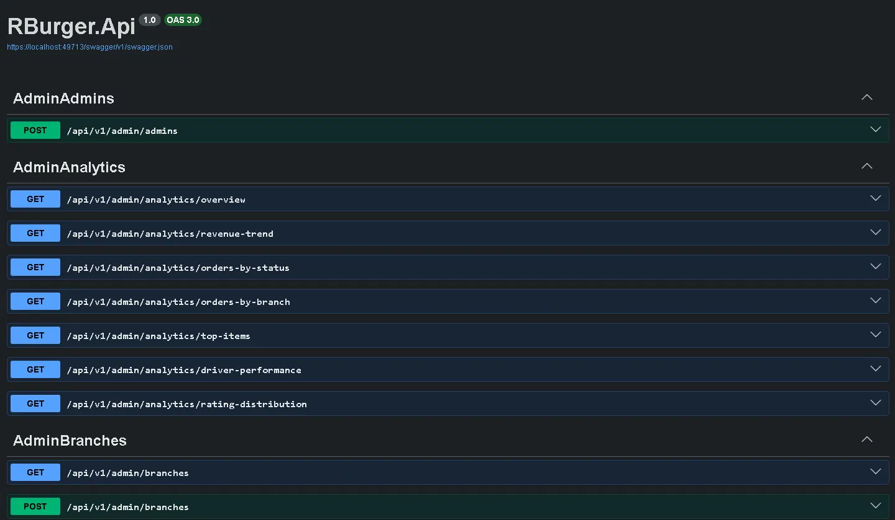
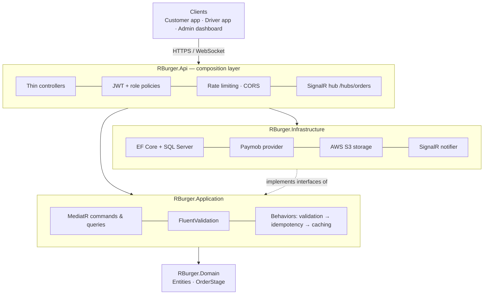
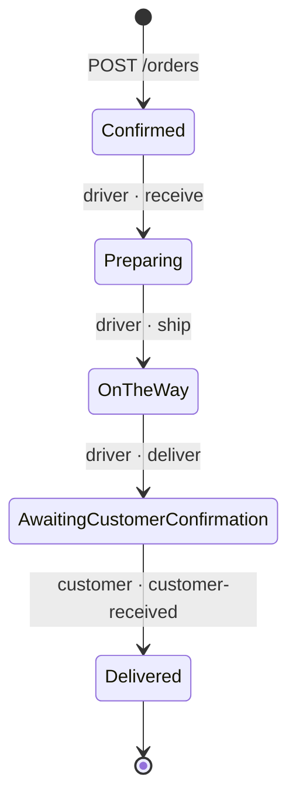
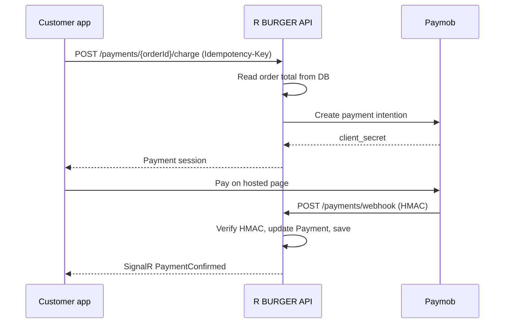
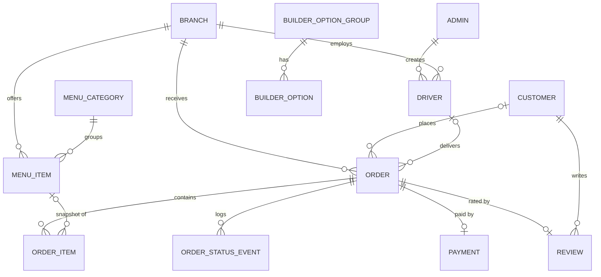

<div align="center">

# 🍔 R BURGER — Backend API

**Food-delivery backend built with ASP.NET Core 8, Clean Architecture, CQRS and SignalR**


</div>

R BURGER is the backend for a multi-branch burger delivery platform. One API serves three clients: a **customer app** (browse, build a burger, order, pay, track live), a **driver app** (receive, ship, deliver) and an **admin dashboard** (branches, drivers, menu, orders, reviews, analytics).

It is implemented contract-first against *Technical & Product Documentation v1.2*: routes, payloads, roles, order states and database tables follow that document exactly. Where the document was silent, the decision is recorded in an XML comment at the point of use.

<p align="center">
  
</p>

## Table of contents

- [Features](#features)
- [Architecture](#architecture)
- [Tech stack](#tech-stack)
- [Project structure](#project-structure)
- [Getting started](#getting-started)
- [Configuration](#configuration)
- [Roles and security](#roles-and-security)
- [Order lifecycle](#order-lifecycle)
- [Real-time tracking (SignalR)](#real-time-tracking-signalr)
- [Payments and image storage](#payments-and-image-storage)
- [Database](#database)
- [API reference](#api-reference)
- [Error format](#error-format)
- [Testing](#testing)
- [Project status](#project-status)

## Features

- **Three roles** — Customer, Driver, Admin — with JWT bearer auth, refresh-token rotation and server-side role checks on every route.
- **Server-side pricing** — the client sends item ids and quantities; subtotal, delivery fee and total are always computed from the database.
- **Burger builder** — option groups and options, plus custom burger lines on orders.
- **Five-stage order lifecycle** with an audit trail (`OrderStatusEvents`) and live updates over SignalR.
- **Online and cash payments** — Paymob payment intention, HMAC-verified webhook and refunds, behind an `IPaymentProvider` abstraction.
- **Menu photos on AWS S3** — validated `multipart/form-data` upload, object key stored, previous image replaced safely.
- **Idempotency** on the endpoints where a retry could duplicate work (create order, charge payment, upload image).
- **Admin analytics** — seven endpoints: overview, revenue trend, orders by status and branch, top items, driver performance, rating distribution.
- **Bilingual data** — Arabic and English names and labels; Arabic is the default response culture.
- **Hardening** — fixed-window rate limiting, CORS allow-list, forwarded headers, problem-details errors with stable error codes, no internal exception details in responses.

## Architecture



Dependencies point inward. Controllers contain no business logic: every write is a MediatR **command**, every read is a **query**. Business rules live in the Application and Domain layers; Infrastructure implements the interfaces the Application layer defines (repositories, payments, storage, caching, real-time).

## Tech stack

| Area | Technology |
|---|---|
| Runtime / framework | .NET 8, ASP.NET Core 8 Web API |
| Architecture | Clean Architecture, CQRS |
| Mediator / validation / mapping | MediatR 12, FluentValidation 11, Mapster 7 |
| Data | EF Core 8 (Code First), SQL Server |
| Auth | JWT Bearer, role-based authorization, ASP.NET Core Identity password hasher |
| Real-time | ASP.NET Core SignalR |
| Payments | Paymob |
| Storage | AWS S3 (AWSSDK.S3) |
| API docs | Swashbuckle (Swagger / OpenAPI) |
| Tests | xUnit, `Microsoft.AspNetCore.Mvc.Testing` |

## Project structure

```text
RBurger-api/
├── src/
│   ├── RBurger.Domain/            Entities and the OrderStage enum — no dependencies
│   ├── RBurger.Application/       CQRS handlers, DTOs, validators, interfaces, pipeline behaviors
│   ├── RBurger.Infrastructure/    EF Core, repositories, JWT, Paymob, S3, SignalR, cache, migrations
│   └── RBurger.Api/               Controllers, Program.cs, middleware, exception handler
├── tests/
│   ├── RBurger.Application.Tests/       Unit tests (hand-written in-memory fakes)
│   └── RBurger.Api.IntegrationTests/    WebApplicationFactory auth-matrix tests
└── RBurger.sln
```

## Getting started

**Requirements:** .NET 8 SDK and SQL Server (local, container or hosted). Paymob and AWS credentials are only needed for online payment and photo upload.

```bash
git clone https://github.com/ahmedsfwt/RBurger-api.git
cd RBurger-api

# 1. Secrets (never put real values in appsettings.json)
dotnet user-secrets set "ConnectionStrings:DefaultConnection" "Server=.;Database=RBurger;Trusted_Connection=True;TrustServerCertificate=True" --project src/RBurger.Api
dotnet user-secrets set "Jwt:Issuer"   "rburger"      --project src/RBurger.Api
dotnet user-secrets set "Jwt:Audience" "rburger-apps" --project src/RBurger.Api
dotnet user-secrets set "Jwt:Key"      "<random string, 32+ characters>" --project src/RBurger.Api

# 2. Build and create the database
dotnet restore
dotnet build
dotnet ef database update --project src/RBurger.Infrastructure --startup-project src/RBurger.Api

# 3. Run
dotnet run --project src/RBurger.Api
```

- Swagger UI (Development): `https://localhost:49713/swagger`
- Health check: `GET /health` → `{ "status": "healthy" }` (no database round-trip, suitable for load-balancer probes)
- The application **refuses to start** if `Jwt:Issuer`, `Jwt:Audience` or `Jwt:Key` is missing; there is no default signing key.
- The first administrator is created by the `SeedInitialAdmin` migration. Further admins are created with `POST /api/v1/admin/admins`.

## Configuration

| Key | Purpose | Required |
|---|---|---|
| `ConnectionStrings:DefaultConnection` | SQL Server connection string | Yes |
| `Jwt:Issuer`, `Jwt:Audience`, `Jwt:Key` | Token signing and validation | Yes |
| `Jwt:ExpiresInSeconds` | Access-token lifetime (default `3600`) | No |
| `RefreshToken:ExpiresInDays` | Refresh-token lifetime (default `30`) | No |
| `RateLimiting:AuthPermitLimit`, `AuthWindowSeconds` | Limit on `/auth/*` (default 10 per 60 s) | No |
| `RateLimiting:PaymentPermitLimit`, `PaymentWindowSeconds` | Limit on `/payments/*` (default 20 per 60 s) | No |
| `Paymob:SecretKey`, `HmacSecret`, `IntegrationId` | Paymob credentials | For online payment |
| `Paymob:BaseUrl`, `Paymob:NotificationUrl` | Gateway URL and public webhook URL | For online payment |
| `AWS:Region`, `AWS:BucketName` | S3 bucket (credentials come from the standard AWS provider chain) | For photo upload |

In production, supply these as environment variables (`Jwt__Key`) or from your secrets manager. CORS origins are listed in `Program.cs` (`AllowFrontend` policy).

## Roles and security

| Role | How the account is created | Can do |
|---|---|---|
| **Customer** | `POST /auth/customer/signup` | Browse, order, pay, track, confirm receipt, review once per order |
| **Driver** | Only by an Admin: `POST /admin/drivers` (there is **no** driver sign-up) | See unclaimed orders, receive, ship, deliver |
| **Admin** | Seeded first admin, then `POST /admin/admins` | Full management and analytics |

- JWT: issuer, audience, signature and lifetime validated, 30-second clock skew, `role` claim. For SignalR the token may be sent as `?access_token=` on the hub path only.
- Refresh tokens are random, stored only as SHA-256 hashes, rotated on every use, and revoked on reuse.
- Prices, totals, payment state, order stage and driver assignment are never taken from the client.
- Raw card numbers never reach the backend; payment happens on the provider's hosted flow.
- Auth routes and payment routes are rate-limited per client IP.

## Order lifecycle



| Stage | Value |
|---|---|
| `Confirmed` | 0 |
| `Preparing` | 1 |
| `OnTheWay` | 2 |
| `AwaitingCustomerConfirmation` | 3 |
| `Delivered` | 4 |

Every transition validates the current stage and the caller, saves to the database (and appends an `OrderStatusEvent`), and only then broadcasts. Common failures: `422 INVALID_ORDER_STAGE`, `403` for a driver who is not assigned, `409 ORDER_ALREADY_RECEIVED` when another driver claimed the order first. Admin cancellation is a separate flag (`IsCancelled`) layered on top of the stage.

## Real-time tracking (SignalR)

Hub: `/hubs/orders` (JWT required). Clients join groups with server-validated methods; an unauthorized join is silently ignored.

| Group | Join method | Who may join | Events |
|---|---|---|---|
| `order-{orderId}` | `JoinOrder(orderId)` | Owning customer, assigned driver, any admin | `OrderStatusChanged`, `PaymentConfirmed` |
| `branch-{branchId}` | `JoinBranch(branchId)` | Drivers of that branch | `NewOrderAvailable` |
| `admin-branch-overview` | `JoinAdminOverview()` | Admins | Overview updates |

SignalR is not the source of truth: events are sent after the database write, and clients can always re-read state over REST.

## Payments and image storage

**Paymob (card payments)**



The webhook is the only thing that moves a card payment to `captured` or `failed`. Cancelling a paid card order refunds through the provider first and changes local state only if the refund succeeds.

**AWS S3 (menu photos)**

- `POST /api/v1/admin/menu-items/{id}/image` — `multipart/form-data`, max 5 MB, `image/jpeg`, `image/png` or `image/webp`.
- Stored under `menu-items/{id}/{uuid}.{ext}`; the previous object is deleted only after the new one is written.
- The bucket is public-read through a bucket policy (object ACLs are blocked on new buckets).

## Database

EF Core Code First on SQL Server, timestamps in UTC, migrations under `src/RBurger.Infrastructure/Migrations`.



Also present: `RefreshTokens` (hashed refresh tokens) and `IdempotencyRecords` (request de-duplication). Design notes: order history uses `Restrict` deletes; deleting a customer sets `Orders.CustomerId` to null; order lines store a snapshot of name and price.

```bash
cd src/RBurger.Infrastructure
dotnet ef migrations add <Name> --startup-project ../RBurger.Api
dotnet ef database update --startup-project ../RBurger.Api
```

## API reference

Base path: `/api/v1`. Routes marked † require an `Idempotency-Key` header. The generated OpenAPI document at `/swagger` is the authoritative reference for request and response bodies.

<details>
<summary><b>Authentication and public routes</b></summary>

| Method | Route | Auth |
|---|---|---|
| POST | `/auth/customer/signup` | Public |
| POST | `/auth/customer/login` | Public |
| POST | `/auth/driver/login` | Public |
| POST | `/auth/admin/login` | Public |
| POST | `/auth/refresh` | Public |
| POST | `/auth/logout` | Public |
| GET | `/branches` | Public |
| GET | `/menu` | Public |
| GET | `/builder/options` | Public |

</details>

<details>
<summary><b>Customer</b></summary>

| Method | Route | Auth |
|---|---|---|
| GET | `/customers/me` | Customer |
| POST | `/orders` † | Customer |
| GET | `/orders/mine` | Customer |
| GET | `/orders/{orderId}` | Customer, Driver |
| POST | `/orders/{orderId}/customer-received` | Customer |
| POST | `/orders/{orderId}/review` | Customer |
| POST | `/payments/{orderId}/charge` † | Customer |
| POST | `/payments/webhook` | Public (HMAC-verified) |

</details>

<details>
<summary><b>Driver</b></summary>

| Method | Route | Auth |
|---|---|---|
| GET | `/driver/orders/new` | Driver |
| GET | `/driver/orders/mine` | Driver |
| POST | `/driver/orders/{orderId}/receive` | Driver |
| POST | `/driver/orders/{orderId}/ship` | Driver |
| POST | `/driver/orders/{orderId}/deliver` | Driver |

</details>

<details>
<summary><b>Admin</b></summary>

| Method | Route |
|---|---|
| POST | `/admin/admins` |
| POST, GET | `/admin/drivers` |
| PUT, DELETE | `/admin/drivers/{id}` |
| PATCH | `/admin/drivers/{id}/status`, `/admin/drivers/{id}/toggle-status` |
| GET | `/admin/customers` |
| DELETE | `/admin/customers/{id}` |
| GET, POST | `/admin/branches` |
| PUT, DELETE | `/admin/branches/{id}` |
| PATCH | `/admin/branches/{id}/toggle-status` |
| GET, POST | `/admin/menu-items` |
| POST | `/admin/menu-items/categories` |
| PUT, DELETE | `/admin/menu-items/{id}` |
| PATCH | `/admin/menu-items/{id}/toggle-availability` |
| POST †, DELETE | `/admin/menu-items/{id}/image` |
| POST | `/admin/builder/option-groups` |
| PUT, DELETE | `/admin/builder/option-groups/{id}` |
| GET | `/admin/orders` (filters: branch, stage, date range; paginated) |
| DELETE | `/admin/orders/{id}` (cancel) |
| GET | `/admin/reviews` |
| DELETE | `/admin/reviews/{id}` |
| GET | `/admin/analytics/overview`, `revenue-trend`, `orders-by-status`, `orders-by-branch`, `top-items`, `driver-performance`, `rating-distribution` |

All admin routes require the `Admin` role.

</details>

Plus `GET /health` and the SignalR hub `/hubs/orders`.

## Error format

Errors use `application/problem+json` with a stable `errorCode` and the request `traceId`:

```json
{
  "type": "https://httpstatuses.io/422",
  "title": "Menu item 7 is not currently available.",
  "status": 422,
  "errorCode": "MENU_ITEM_UNAVAILABLE",
  "traceId": "0HN7..."
}
```

| Status | Error codes |
|---|---|
| 400 | `VALIDATION_ERROR` (adds an `errors` map), `INVALID_WEBHOOK_SIGNATURE` |
| 401 | `INVALID_CREDENTIALS` |
| 403 | `FORBIDDEN` |
| 404 | `NOT_FOUND` |
| 409 | `ORDER_ALREADY_RECEIVED`, `CUSTOMER_RECEIVED_ALREADY_SET`, `DUPLICATE_REVIEW` |
| 422 | `MENU_ITEM_UNAVAILABLE`, `MENU_ITEM_BRANCH_MISMATCH`, `INVALID_ORDER_STAGE`, `ORDER_NOT_DELIVERED`, `ORDER_NOT_RECEIVED` |
| 429 | Rate limit exceeded |
| 502 | `PAYMENT_GATEWAY_ERROR` |
| 503 | `PAYMENT_PROVIDER_NOT_CONFIGURED`, `IMAGE_STORAGE_NOT_CONFIGURED` |

## Testing

```bash
dotnet test
# or, matching the deployment build
dotnet build -c Release
dotnet test -c Release --no-build
```

| Project | What it covers |
|---|---|
| `RBurger.Application.Tests` | Handlers and validators using hand-written in-memory fakes (no mocking framework, no real database): orders, auth, refresh tokens, idempotency, payments and webhook, menu images, analytics, admin modules |
| `RBurger.Api.IntegrationTests` | Boots the real `Program.cs` with `WebApplicationFactory` and asserts the role matrix — every route against no token, Customer, Driver and Admin tokens |

About 380 test methods in total.

## Project status

**Implemented**

- Authentication, refresh-token rotation and role authorization for all three roles
- Public catalogue, burger builder, orders with server-side pricing and idempotency
- Full order lifecycle with audit trail and SignalR events
- Paymob charge, webhook and refund; admin order cancellation rules
- S3 menu photo upload and delete
- Admin management modules and seven analytics endpoints
- Rate limiting, CORS, forwarded headers, localization, health check, Swagger

**Not included / next steps**

- **CloudFront** — photos are currently served from the S3 URL; add a distribution and a domain setting.
- **Background jobs (Hangfire)** — not implemented (for example expiring unpaid orders, cleaning expired tokens).
- **Structured logging (Serilog)** — default ASP.NET Core logging is used.
- **SignalR scale-out** — the hub is in-memory; add a Redis backplane before running more than one API instance.
- **Distributed cache** — `ICacheService` uses `IMemoryCache`; a Redis implementation can replace it without other changes.
- **CI/CD and infrastructure as code** — no workflows or AWS provisioning are part of this repository.

## Author

**Ahmed Safwat** — Backend Developer · [GitHub](https://github.com/ahmedsfwt)
